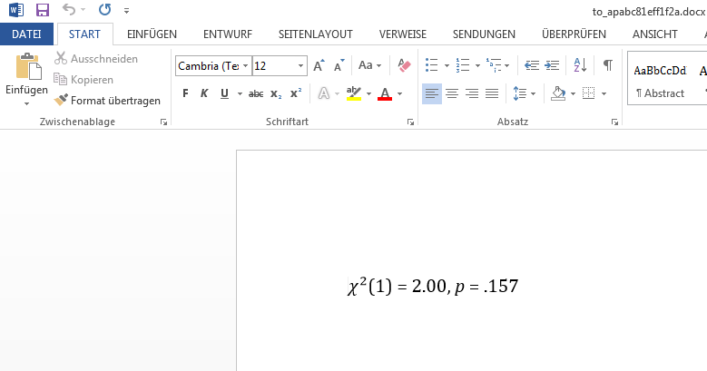

```{r, warning=FALSE, echo=FALSE}
library(psymisc)
library(dplyr, warn.conflicts = FALSE)
library(ez)
library(tidyr)
```

# Format test outputs according to APA guidelines

The `*_apa` functions help you to format test outputs according to APA guidelines. The functions take the return value of a test function as the first argument, e.g. a call to `chisq.test`. Supported tests are t-test (`t.test` and `psymisc::t_test`), ANOVA (`ez::ezANOVA`, `afex::aov_car`, `afex::aov_ez` and `afex::aov_4`), chi-squared-test (`chisq.test`) and test of a correlation (`cor.test`).

```{r}
x <- chisq.test(c(20, 30))
x
chisq_apa(x)
```

The `format` argument allows you to specify the output format, which can be one of `"text"` (default), `"markdown"`, `"rmarkdown"`, `"html"`, `"latex"`, `"docx"` or `"plotmath"`.

```{r}
chisq_apa(x, format = "rmarkdown")
chisq_apa(x, format = "latex")
```

```{r, eval=FALSE}
# Opens a temporary document in your word processor
chisq_apa(x, format = "docx")
```



No more copy-and-paste of single values or writing APA formatted test results by hand. You can simply copy the formatted test output into your manuscript or presentation. Available output format functions are `t_apa`, `anova_apa`, `chisq_apa` and `cor_apa`.

# Descriptive statistics with `ds` and `fplot`

When beginning to analyze a data set, it's usually a good idea to take a look at descriptive statistics. Base R offers the `aggregate` function for computing summary statistics (e.g. mean, standard deviation) of factorial data.

```{r}
aggregate(trait_anx ~ group + gender, hquest, FUN = "mean")
```

Computing a second statistic needs to be done using a second call to `aggregate`:

```{r}
aggregate(trait_anx ~ group + gender, hquest, FUN = "sd")
```

A shortcoming of this function is that it does not allow you to compute multiple statistics at once. With the dplyr package and its functions `group_by` and `summarize`, this can be done more easily:

```{r}
hquest %>%
  group_by(group, gender) %>%
  summarise(mean = mean(trait_anx), sd = sd(trait_anx))
```

The function `ds` in psymisc is a wrapper for these two functions and provides an easy formula interface for descriptive statistics:

```{r}
ds(hquest, trait_anx ~ group + gender)
```

Note that `ds` calculates the mean and standard error of the mean by default. This behavior can be changed by using the `funs` argument:

```{r}
ds(hquest, trait_anx ~ group + gender, funs = c("n", "mean", "sd", "moe"))
```

The `fplot` function can be used to get a graphical overview of descriptive statistics:

```{r}
fplot(hquest, acrophobia ~ group + gender)
# With standard deviation instead of standard error
fplot(hquest, acrophobia ~ group + gender, error = "sd")
# Lines instead of bar plot
fplot(hquest, acrophobia ~ group + gender, geom = "line")
# Boxplot
fplot(hquest, acrophobia ~ group + gender, geom = "boxplot")
```

# Tables with `cor_table` and `stats_table`

Similar to `cor`, `cor_table` computes a correlation matrix but in addition indicates significance with asterisks.

```{r}
cor_table(hquest[4:7])
# HTML format
cor_table(hquest[4:7], format = "html")
```

For comparision of multiple groups of participants, the `stats_table` prints a table

```{r}
stats_table(hquest, iv = group, dvs = age:sens_seek)
# HTML format opens in the RStudio Viewer pane and allow copy & paste to Word
stats_table(hquest, iv = group, dvs = age:sens_seek, format = "html")
```

# Further functions

See a list of all psymisc functions at https://github.com/dgromer/psymisc or run `ls("package:psymisc")` in the R console after loading psymisc. Furthermore, the help page of each function lists usage examples.
